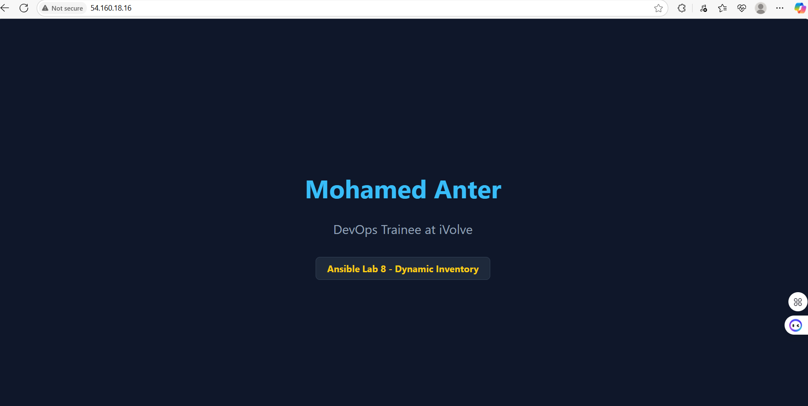

# Lab 8 - Ansible Dynamic Inventory with AWS EC2

This lab demonstrates how to dynamically manage AWS EC2 instances using **Ansible's dynamic inventory plugin** (`amazon.aws.aws_ec2`).

---

## ✅ Objective

- Use AWS EC2 plugin to fetch running EC2 instances dynamically.
- Use dynamic inventory to `ping`, `run commands`, and `deploy Nginx` to EC2 instances.
- Host a custom webpage on EC2 and expose it over the internet.
- Verify setup by accessing EC2 public IP.

---

## 📁 Folder Structure

ansible_dynamic_inventory/
│
├── aws_ec2.yml # AWS EC2 dynamic inventory config
├── nginx-playbook.yml # Playbook for installing and configuring nginx
├── readpic.PNG # Screenshot of the webpage


---

## ⚙️ Step-by-Step Commands

### 🔐 1. Connect to EC2

```bash
ssh -i ~/anter.pem ec2-user@<Public-IP>

🌐 2. Install Nginx

sudo dnf install nginx -y
sudo systemctl start nginx
sudo systemctl enable nginx


🎨 3. Customize Web Page

sudo nano /usr/share/nginx/html/index.html


🚀 4. Verify Nginx is running

curl http://localhost


🌍 5. Access from Browser


http://<EC2-Public-IP>


🖼 Screenshot
## 🖼 Screenshot




