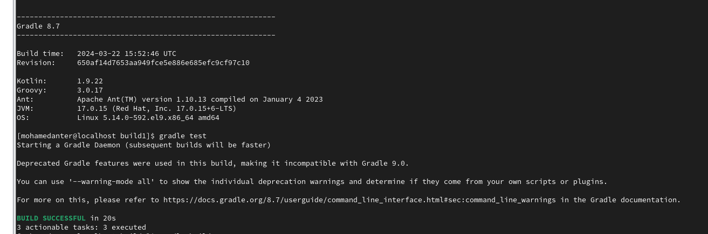
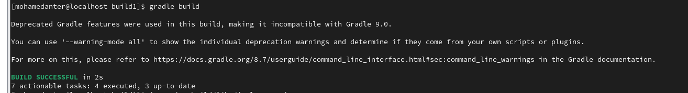
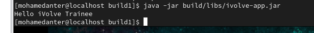

# Lab 9: Build Java Application using Gradle

This lab demonstrates how to build and run a Java application using Gradle.  
We clone a repository, run unit tests, build a JAR file, and run the app.

---

## 🎯 Objectives

- Install Gradle manually
- Clone and build a Java project
- Run tests and verify the output
- Generate a JAR artifact and run it
- Document the process visually

---

## 📁 Folder Structure

Lab9_build_java_app_using_gradle/
│
├── build1/ # Cloned Java project
├── lab9_1.PNG # Screenshot of gradle test
├── lab9_2.PNG # Screenshot of gradle build
├── lab9_3.PNG # Screenshot of java jar output
└── README.md # This file
 ----------------------------------------------------


---

## 🛠️ Steps

### 1️⃣ Install Gradle (Manual Method)

```bash
wget https://services.gradle.org/distributions/gradle-8.7-bin.zip -P /tmp
sudo unzip -d /opt/gradle /tmp/gradle-8.7-bin.zip

sudo tee /etc/profile.d/gradle.sh > /dev/null <<EOF
export GRADLE_HOME=/opt/gradle/gradle-8.7
export PATH=\$PATH:\$GRADLE_HOME/bin
EOF

sudo chmod +x /etc/profile.d/gradle.sh
source /etc/profile.d/gradle.sh

---
2️⃣ Install Java (If Not Installed)

---
sudo yum install java-11-openjdk -y
java -version

3️⃣ Clone the Project
---
git clone https://github.com/Ibrahim-Adel15/build1.git
cd build1


```markdown
### 4️⃣ Run Unit Tests

🖼️ **Screenshot:**


```bash
gradle test


### 5️⃣ Build the Application

🖼️ **Screenshot:**


```bash
gradle build


### 6️⃣ Run the App

🖼️ **Screenshot:**


```bash
java -jar build/libs/ivolve-app.jar


✅ Result
Hello iVolve Trainee

