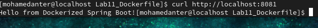
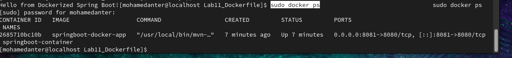

# Lab 11: Run Java Spring Boot App in a Container

This lab demonstrates how to run a Java Spring Boot application inside a Docker container using both pre-built `.jar` and multi-stage Docker builds.

---

## 🧩 Objective

Build and deploy a Spring Boot app in a Docker container using two approaches:
- Build the app **before** containerizing
- Build the app **inside** a Dockerfile

---

## 📦 Step-by-Step Instructions

### 1. Clone the Project
```bash
git clone https://github.com/Ibrahim-Adel15/Docker-1.git
cd Docker-1
```

---

## 🚀 Approach 1: Dockerfile (Build Inside Docker)

### Dockerfile
```Dockerfile
FROM maven:3.9.10-eclipse-temurin-11-alpine

WORKDIR /app

COPY Docker-1/ .

RUN mvn package

CMD ["java", "-jar", "target/demo-0.0.1"]

EXPOSE 8080

```

### Commands
```bash
docker build -t springboot-app .
docker run -d -p 8081:8080 --name springboot-container springboot-app
```

---

##  Test the App
```bash
curl http://localhost:8081
```


Or open in your browser: `http://localhost:8081`

---

## 🛑 Stop and Remove the Container
```bash
docker stop springboot-container
docker rm springboot-container
```

---

## 🔁 Approach 2: Build First, Then Containerize

### Pre-build the App
```bash
mvn clean package
```

### Simplified Dockerfile
```Dockerfile
FROM openjdk:17
WORKDIR /app
COPY target/demo-0.0.1-SNAPSHOT.jar app.jar
EXPOSE 8081
ENTRYPOINT ["java", "-jar", "app.jar"]
```

### Then:
```bash
docker build -t springboot-app .
docker run -d -p 8081:8080 --name springboot-container springboot-app
```

```bash
sudo docker ps 


---

## ✅ Outcome

You successfully:
- Built a Spring Boot app using Maven
- Containerized it using Docker
- Tested it using `curl` or browser access
