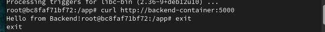
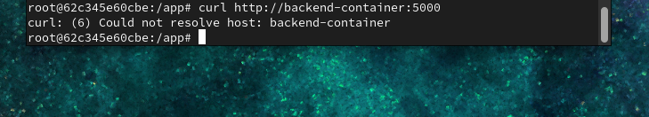

# Lab 15: Custom Docker Network for Microservices

## 🎯 Objective
Deploy two microservices (frontend & backend) using Docker with:
- Custom Docker network to allow service-to-service communication.
- Testing container communication across custom and default networks.

---

## 🧪 Steps

### 1. Clone the Project Repo
```bash
git clone https://github.com/Ibrahim-Adel15/Docker5.git
cd Docker5
```

2. Backend Service
📝 Dockerfile for backend/
```bash
FROM python:3.9-slim

WORKDIR /app

COPY . .

RUN pip install flask

EXPOSE 5000

CMD ["python", "app.py"]
```
⚙ Build Backend Image
```bash
cd backend
docker build -t backend-image .
```
3. Frontend Service
```bash
FROM python:3.9-slim

WORKDIR /app

COPY . .

RUN pip install -r requirements.txt

EXPOSE 5000

CMD ["python", "app.py"]
```
⚙ Build Frontend Image
```bash
cd ../frontend
docker build -t frontend-image .
```
------------------------------------------------
4. Create Custom Docker Network
```bash
docker network create ivolve-network
```
--------------------------------
5. Run Containers
🟢 Backend (on custom network)
```bash
docker run -d \
  --name backend-container \
  --network ivolve-network \
  backend-image
```
🟢 Frontend1 (on custom network)
```bash
docker run -d \
  --name frontend1-container \
  --network ivolve-network \
  -p 8087:5000 \
  frontend-image
```
🔴 Frontend2 (on default bridge network)
```bash
docker run -d \
  --name frontend2-container \
  -p 8088:5000 \
  frontend-image
```
------------
6. Test Communication
✅ From frontend1 → backend (should succeed)
```bash
docker exec -it frontend1-container bash
apt update && apt install -y curl
curl http://backend-container:5000
```


❌ From frontend2 → backend (should fail)
```bash
docker exec -it frontend2-container bash
apt update && apt install -y curl
curl http://backend-container:5000
```

-----------------------------------
7. Clean Up
```bash
docker rm -f backend-container frontend1-container frontend2-container
docker network rm ivolve-network
```


------------------------------------------------------------------------------------------


