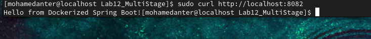

# Lab 12: Multi-Stage Build for a Java Application Using Docker

This lab demonstrates how to build and run a Java application using Docker multi-stage builds to reduce image size and separate build/runtime environments.

---

## 🧪 Lab Steps

### 1. Clone the Application Code

```bash
git clone https://github.com/Ibrahim-Adel15/Docker-1.git
cd Docker-1
```

---

### 2. Create Multi-Stage Dockerfile

Create a file named `Dockerfile` in the project root with the following content:

```dockerfile
# ===== Stage 1: Build =====
# First stage: build the app
FROM maven:3.9.10-eclipse-temurin-17-alpine AS build

# Create app directory
WORKDIR /app

# Copy application source code
COPY ../before_build/Docker-1/ .

# Package the application
RUN mvn package

# ===== Stage 2: Run =====
# Second stage: run the app
FROM eclipse-temurin:17-jdk-alpine

WORKDIR /app

# Copy the JAR from the build stage
COPY --from=build /app/target/demo-0.0.1-SNAPSHOT.jar app.jar

# Expose port 8080
EXPOSE 8080

# Run the application
CMD ["java", "-jar", "app.jar"]
```

---

### 3. Build the Docker Image

```bash
docker build -t java-multistage-app .
```

---

### 4. Run the Docker Container

```bash
sudo docker run -d -p 8082:8080 --name nodejs-multistage-container nodejs-multistage-app

```

---

### 5. Test the Application

Open your browser or use `curl`:

```bash
curl http://localhost:8082
```


---

### 6. Stop and Delete the Container

```bash
docker ps                   # Get the container ID
docker stop <container_id>
docker rm <container_id>
```

---

## ✅ What You Learned

