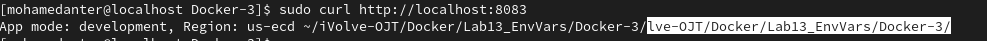
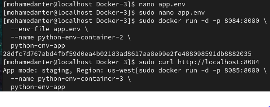
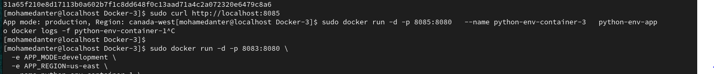

# Lab 13: Docker Environment Variables

This lab demonstrates how to work with environment variables in Docker using a Flask Python application.

---

## 🔧 Project Setup

### 1. Clone the Repository
```bash
git clone https://github.com/Ibrahim-Adel15/Docker-3.git
cd Docker-3
```

---

## 🐳 Dockerfile

### Dockerfile Content:
```dockerfile
FROM python:3.9-slim

# Set default environment variables (production, canada-west)
ENV APP_MODE=production
ENV APP_REGION=canada-west

WORKDIR /app
COPY . /app

RUN pip install flask

EXPOSE 8080

CMD ["python", "app.py"]
```

---

## 🧪 Environment Variable Injection

### Method 1: Run with environment variables via CLI
```bash
sudo docker run -d -p 8083:8080 \
  -e APP_MODE=development \
  -e APP_REGION=us-east \
  --name python-env-container-1 \
  python-env-app

```
## 🧪 Output

Access the app on:  
📍 `http://localhost:8083`



### Method ii: Use environment variables from file

Create a file named `app.env`:
```
APP_MODE=staging
APP_REGION=us-west
```

Then run:
```bash
sudo docker run -d -p 8084:8080 \
  --env-file app.env \
  --name python-env-container-2 \
  python-env-app
```
## 🧪 Output

Access the app on:  
📍 `http://localhost:8084`



### Method iii: Defined inside Dockerfile

No extra flags needed. Just run:
```bash
sudo docker run -d -p 8085:8080 \
  --name python-env-container-3 \
  python-env-app

```

---

## 🧪 Output

Access the app on:  
📍 `http://localhost:8085`


