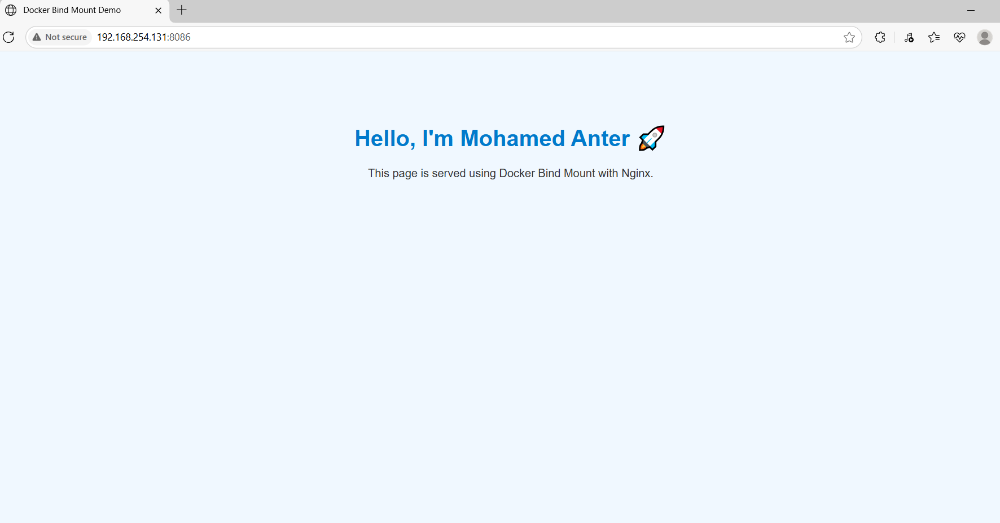
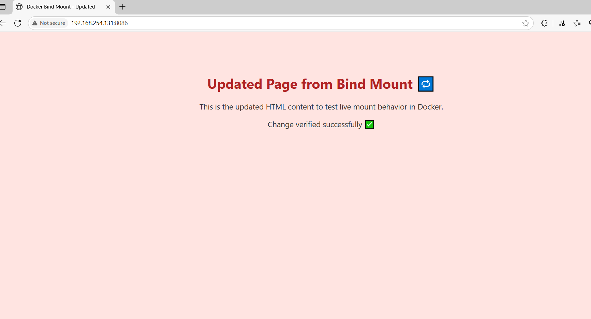

# Lab 14: Docker Volumes and Bind Mount with Nginx

## 🎯 Objective  
Set up an Nginx container using:  
- A **Docker volume** to persist Nginx logs.  
- A **bind mount** to serve a custom HTML page.  

---
## 🧪 Steps

### 1. Create Docker volume
```bash
docker volume create nginx_logs
```
. Create local directory and HTML file

```bash
mkdir -p nginx-bind/html
cd nginx-bind/html
```
3. Run the container
```bash
docker run -d \
  --name nginx-container \
  -v nginx_logs:/var/log/nginx \
  -v $(pwd)/nginx-bind/html:/usr/share/nginx/html \
  -p 8086:80 \
  nginx
```
4. Test from browser or curl
```bash
curl http://localhost:8086
```


5. Modify HTML file and re-test
```bash
curl http://localhost:8086
```



6. Verify logs inside the container
```bash
docker exec -it nginx-container bash
cd /var/log/nginx
cat access.log
```


----------------------
7. Clean up
```bash
docker rm -f nginx-container
docker volume rm nginx_logs
```


---------------
📂 Reference
```bash
docker volume inspect nginx_logs
```


