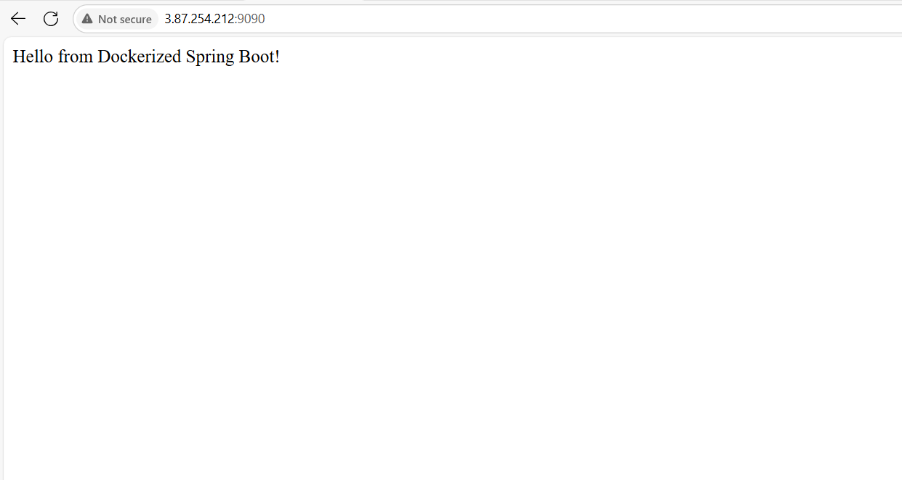
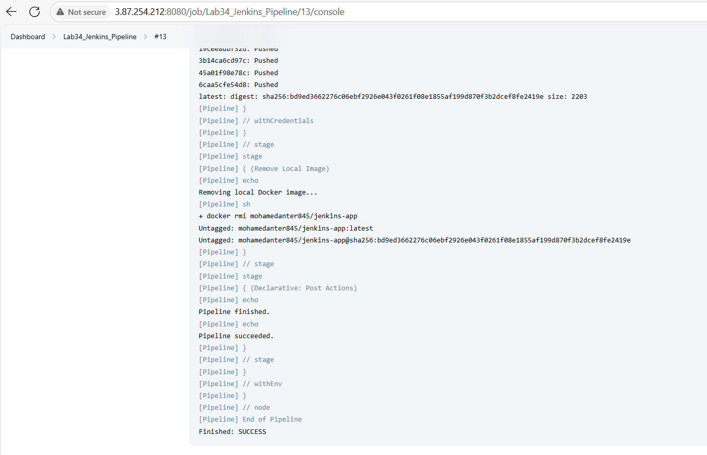

# Lab34 – Jenkins Pipeline with Maven & Docker

This lab demonstrates a full CI/CD pipeline using Jenkins, Maven, and Docker, automating the build, test, and deployment of a Java application.

---

## 📌 Lab Objectives

- Install and configure Jenkins on a Linux machine
- Create a Declarative Jenkins Pipeline from scratch
- Build a Java application using Maven
- Containerize the app with Docker
- Push Docker image to Docker Hub
- Deploy and test the Docker container

---

## 📂 Project Structure

```bash
Lab34_Jenkins_Pipeline/
├── Dockerfile
├── Jenkinsfile
├── pom.xml
└── src/
```

---

## ⚙️ Technologies Used

- **Jenkins**
- **Maven**
- **Docker**
- **GitHub**
- **Java 11+**
- **Ubuntu 22.04**

---

## 🚀 Pipeline Stages

| Stage Name           | Description                                      |
|----------------------|--------------------------------------------------|
| Clone Source Code    | Clones the GitHub repository                    |
| Run Unit Test        | Runs `mvn test` on the project                  |
| Build App            | Builds the JAR using `mvn package`             |
| Build Docker Image   | Builds Docker image from the local Dockerfile   |
| Push Docker Image    | Pushes the image to Docker Hub                  |
| Remove Local Image   | Cleans up the local Docker image after push     |
| Test Deployment      | (Optional) Verifies the app is running properly |

---

## 🐳 Docker Hub

**Repo**: [https://hub.docker.com/repository/docker/mohamedanter845/jenkins-app](https://hub.docker.com/repository/docker/mohamedanter845/jenkins-app)

---

## 🌐 Run the App

To run the Docker container manually after pushing:

```bash
docker run -d -p 9090:8080 mohamedanter845/jenkins-app
````

Then open your browser at:
http://<your-public-ip>:9090


Jenkinsfile is managed locally and not stored in the GitHub repo.

Used Pipeline script in Jenkins job instead of Pipeline from SCM.

Docker credentials are stored using Jenkins Credentials Manager (ID: dockerhub-creds-id).


```bash
👨‍💻 Author
Mohamed Anter
GitHub: @mohamedanter
DockerHub: mohamedanter845
```

### Unit Test Result



### Docker Image Pushed

