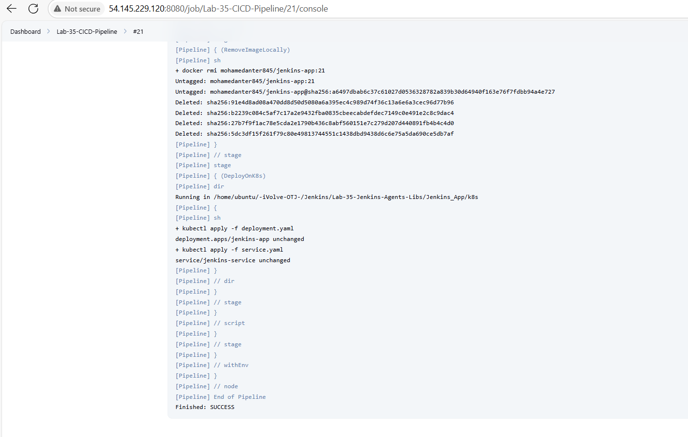
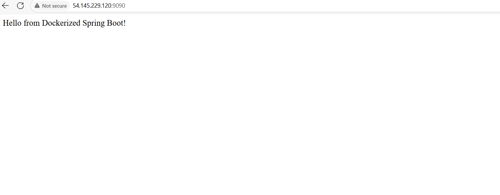
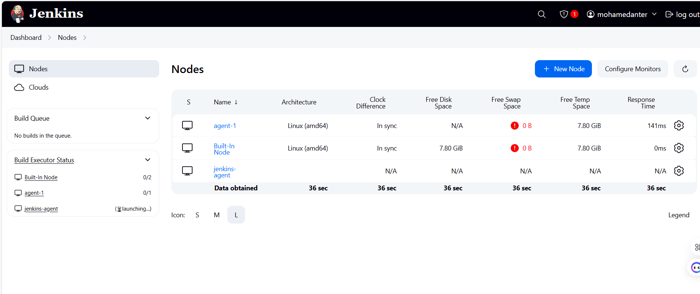
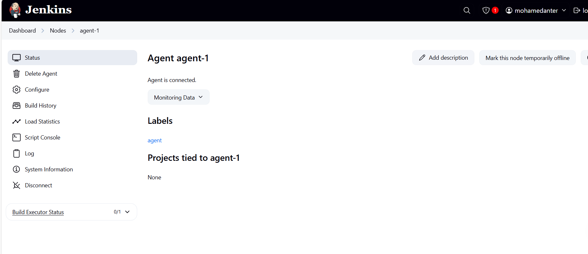

# 🚀 Lab 35: Jenkins Shared Library with Agents & Kubernetes Deployment

This lab demonstrates a **CI/CD pipeline** using **Jenkins Shared Libraries** and **Jenkins Agents** to:
- Build and test a Java Maven application.
- Create a Docker image and push it to Docker Hub.
- Deploy the application to a Kubernetes cluster.

---

## 📂 Project Structure
```bash
Lab-35-Jenkins-Agents-Libs/
├── Jenkins_App/
│ ├── Dockerfile
│ ├── k8s/
│ │ ├── deployment.yaml
│ │ └── service.yaml
│ └── target/demo-0.0.1-SNAPSHOT.jar
│
├── shared-libraries/
│ └── vars/
│ ├── runUnitTests.groovy
│ ├── buildApp.groovy
│ ├── buildImage.groovy
│ ├── scanImage.groovy
│ ├── pushImage.groovy
│ ├── removeImage.groovy
│ └── deployOnK8s.groovy
│
├── lab35_1.PNG
├── lab35_2.PNG
├── lab35_3.PNG
└── lab35_4.PNG
```

---

## 🧩 **Shared Library Functions**

| Function Name             | Description                                    |
|---------------------------|------------------------------------------------|
| `runUnitTests()`          | Runs unit tests using Maven                    |
| `buildApp()`              | Builds the Java Maven application              |
| `buildImage(img)`         | Builds a Docker image from source code         |
| `scanImage(img)`          | Scans the Docker image (security scan)         |
| `pushImage(img, user, pass)` | Pushes image to Docker Hub                  |
| `removeImage(img)`        | Removes image locally after pushing            |
| `deployOnK8s(api, token, ns, img, file)` | Deploys app on Kubernetes        |

---

## 🔗 **Jenkinsfile Usage**

```groovy
@Library('jenkins-shared-library') _

pipeline {
    agent { label 'agent-1' }

    environment {
        DOCKER_USERNAME = credentials('Docker-User')
        DOCKER_PASSWORD = credentials('Docker-Password')
        DOCKER_IMAGE = "${DOCKER_USERNAME}/jenkins-app:${BUILD_NUMBER}"
        K8S_API_SERVER = credentials('api-server')
        K8S_TOKEN = credentials('token')
        NAMESPACE = 'ivolve'
        DEPLOYMENT_FILE = 'Jenkins_App/k8s/deployment.yaml'
    }

    stages {
        stage('Run Tests') { steps { runUnitTests() } }
        stage('Build App') { steps { buildApp() } }
        stage('Build Image') { steps { buildImage(env.DOCKER_IMAGE) } }
        stage('Scan Image') { steps { scanImage(env.DOCKER_IMAGE) } }
        stage('Push Image') { steps { pushImage(env.DOCKER_IMAGE, env.DOCKER_USERNAME, env.DOCKER_PASSWORD) } }
        stage('Remove Image') { steps { removeImage(env.DOCKER_IMAGE) } }
        stage('Deploy to K8s') { steps { deployOnK8s(env.K8S_API_SERVER, env.K8S_TOKEN, env.NAMESPACE, env.DOCKER_IMAGE, env.DEPLOYMENT_FILE) } }
    }
}
````
----------------------
🔐 Jenkins Credentials Required
Before running the pipeline, ensure these credentials are created in Jenkins:

Docker-User – Docker Hub username.

Docker-Password – Docker Hub password/token.

api-server – Kubernetes API endpoint.

token – Kubernetes access token.

```
🖥 Jenkins Agent
The pipeline is executed on a dedicated Jenkins agent with the label
```bash
agent-1
```
 CI/CD Pipeline
```bash

Run Tests – Runs Maven unit tests.

Build App – Packages the app.

Build Image – Creates Docker image.

Scan Image – (Placeholder for scanning).

Push Image – Pushes to Docker Hub.

Remove Image – Cleans up local images.

Deploy to K8s – Applies Kubernetes manifests.

````
## 📸 Screenshots






